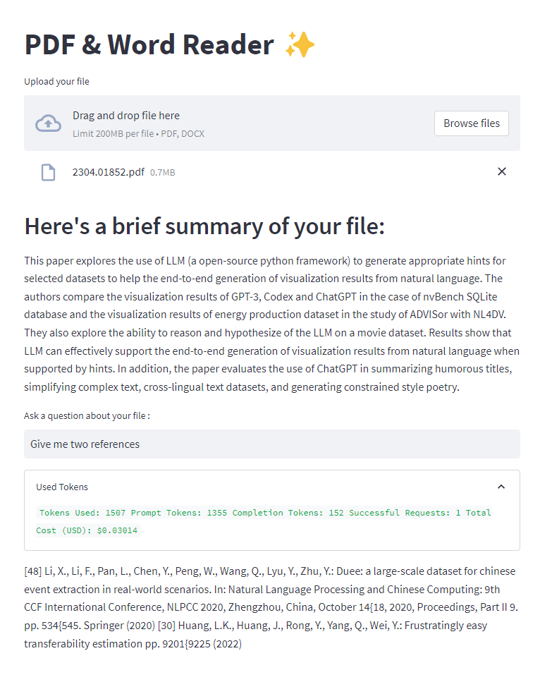

# Langchain PDF & Word Reader

The PDF & Word Reader is a project aimed at providing functionality to perform Summarisation and Retrieval QA on PDF and Word documents. This project is built using Streamlit, a popular Python library for creating web applications, and LangChain, a framework for developing applications powered by language models. It leverages the power of the OpenAI model to process and analyse the documents.



## Acknowledgment
This project was inspired by the work of Alejandro AO and his langchain-ask-pdf project, which can be found at [[Alejandro AO's langchain-ask-pdf]](https://github.com/alejandro-ao/langchain-ask-pdf). Alejandro AO also created a tutorial on YouTube explaining the project, which you can watch at [his tutorial on YT](https://www.youtube.com/watch?v=wUAUdEw5oxM).

## Enhancements and Modifications
In this project, I have made several customisations and improvements to the original functionality. These include:

1. **Workaround for Max Token Limit**: I have devised a workaround to overcome the limitation imposed by the maximum token limit 4097. This workaround involves utilising map-reduce chain_type and RecursiveCharacterTextSplitter, allowing pre-summarisation in processing of larger documents.

2. **Callback Token Used Count**: To optimise the usage of OpenAI's API, an expander that tracks callback tokens used during the QA process is added.

4. **Error Handling**: Which doesn't really exist in the original repo.

5. **Summary Prompt**: Generation of a concise summary of the extracted text whenever a file is uploaded. This can be useful for quickly grasping the main points of the document.


## Installation

To install and set up the PDF & Word Reader project, follow these steps:

1. Clone the repository:

- `git clone https://github.com/lenkazuma/PDFReader.git`

3. Navigate to the project directory:

- `cd PDFReader`

3. Install the required dependencies using pip:

- Install requirements : `pip install -r requirements.txt`

## Deployment

The PDF & Word Reader application is deployed on Streamlit Cloud. You can access the deployed version at [PDFReader-LongChain](https://pdfreader-longchain.streamlit.app/). Please note that there is a misspelling in the URL, as "LangChain" is mistakenly written as "LongChain".

If you want to deploy your own version of the application, follow these steps:

1. Sign up for Streamlit at [https://streamlit.io](https://streamlit.io).

2. Configure your Streamlit application settings and navigate to the "APP Settings" section.

3. Add your OpenAI API key in the "Secrets" configuration. This will allow the application to utilize the OpenAI API for document processing.

4. Once your settings are configured, you can deploy the application on Streamlit Cloud using the Streamlit command-line interface (CLI) or through the Streamlit web interface.

- Using the CLI:
  ```
  streamlit deploy your-app-name
  ```

- Using the web interface:
  1. Log in to [https://streamlit.io](https://streamlit.io).
  2. Navigate to your application's repository.
  3. Click on the "Deploy" button and follow the instructions provided.

That's it! Your PDF & Word Reader application will be deployed and accessible via the provided URL.

## Currently working on
Add OCR image pdf text extraction for different languages.
